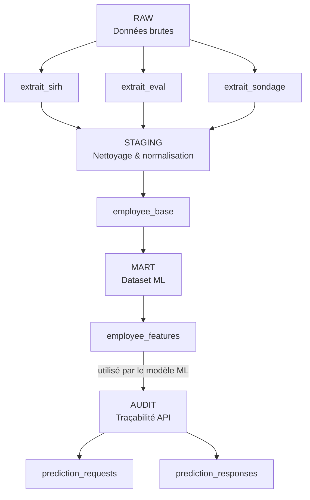

# Technova ML API

## Sommaire
- [Présentation du projet](#présentation-du-projet)
- [Structure du projet](#structure-du-projet)
- [Architecture globale](#architecture-globale)
- [Intégration Continue et Déploiement Continu](#intégration-continue-et-déploiement-continu)
- [Architecture des données (BDD)](#architecture-des-données-bdd)
- [Modèle de Machine Learning](#modèle-de-machine-learning)
- [API FastAPI](#api-fastapi)
- [Sécurité et authentification](#sécurité-et-authentification)
- [Audit et traçabilité](#audit-et-traçabilité)
- [Tests et qualité du code](#tests-et-qualité-du-code)
- [Déploiement](#déploiement)
- [Installation et utilisation](#installation-et-utilisation)


---

## Présentation du projet

**Technova ML API** est une API de prédiction d’attrition des employés basée sur un modèle de Machine Learning.
Elle permet de prédire la probabilité de départ d’un employé à partir de données RH structurées.

---

## Structure du projet

Le dépôt est organisé de manière modulaire afin de séparer
les responsabilités (API, ML, base de données, tests).

```text
technova-ml-api/
├─ app/
│  ├─ main.py              # Point d’entrée de l’API FastAPI
│  ├─ core/                # Configuration et settings
│  ├─ security/            # Authentification (API Key)
│  ├─ ml/                  # Chargement du modèle et prédictions
│  ├─ services/            # Logique métier (predict, audit)
│  ├─ db/                  # Connexion DB et scripts SQL
│  └─ schemas/             # Schémas Pydantic (entrées/sorties)
│
├─ db/
│  ├─ schema.sql           # Création des schémas PostgreSQL
│  ├─ raw.sql              # Tables de données brutes
│  ├─ staging.sql          # Nettoyage et transformations
│  ├─ mart.sql             # Dataset final pour le modèle ML
│  └─ audit.sql            # Journalisation des prédictions
│
├─ tests/                  # Tests unitaires et fonctionnels (Pytest)
│
├─ .github/workflows/      # Pipeline CI (tests automatiques)
├─ requirements.txt
└─ README.md
```
---

## Architecture globale

- API développée avec **FastAPI**
- Base de données **PostgreSQL**
- Modèle ML entraîné en amont (hors API), puis chargé au démarrage de l’application
- Déploiement local et sur **Hugging Face Spaces**
- Sécurité par **API Key**
- Tests automatisés avec **Pytest**


---
## Intégration Continue et Déploiement Continu

Le projet intègre une démarche d’intégration continue (CI) afin de garantir
la qualité et la stabilité du code à chaque modification.
Les mises à jour du code ou du modèle sont réalisées via des commits sur la branche principale,
déclenchant automatiquement les tests et le redéploiement de l’API grâce au pipeline CI/CD.

### Intégration Continue (CI)
- Pipeline automatisé via **GitHub Actions**
- Exécution des tests Pytest à chaque push et pull request
- Validation du code avant fusion sur la branche principale
- Détection précoce des régressions

### Déploiement Continu (CD)
- Déploiement de l’API sur **Hugging Face Spaces**
- Gestion des secrets (API Key, accès modèle) via variables d’environnement
- Séparation des environnements (local / CI / production)

Cette approche permet un déploiement fiable, reproductible et sécurisé
du modèle de Machine Learning exposé par l’API.

---

## Architecture des données (BDD)

Les détails techniques concernant la base de données
(schémas, tables, scripts SQL et pipeline de transformation)
sont documentés dans `db/README_SQL.md`.

Le schéma ci-dessous présente le flux logique des données,
de l’ingestion jusqu’à l’audit des prédictions.

### Pipeline de données



### Description des schémas

- **RAW** : données brutes sans transformation.
- **STAGING** : nettoyage, normalisation et jointure des sources.
- **MART** : dataset final utilisé par le modèle ML.
- **AUDIT** : traçabilité complète des appels API et des prédictions.

---

## Modèle de Machine Learning

- Type : classification binaire
- Cible : départ de l’employé
- Sortie : probabilité + décision selon un seuil configurable
- Seuil stocké dans un fichier de configuration


Les performances du modèle ont été évaluées en amont lors du projet de data science,
et le modèle est ici réutilisé comme un composant validé pour un usage en production.
---

## API FastAPI

### Endpoints principaux

- `GET /health` : état de l’API
- `POST /predict` : prédiction à partir de données fournies
- `GET /predict/{id_employee}` : prédiction à partir de la base de données

La documentation est disponible via Swagger :
`/docs`

---
### Exemple POST /predict

```json
{
  "age": 41,
  "genre": "femme",
  "revenu_mensuel": 5993,
  "statut_marital": "célibataire",
  "departement": "commercial",
  "poste": "cadre commercial",
  "nombre_experiences_precedentes": 8,
  "annees_dans_l_entreprise": 2,
  "satisfaction_employee_environnement": 4,
  "satisfaction_employee_nature_travail": 1,
  "satisfaction_employee_equipe": 1,
  "satisfaction_employee_equilibre_pro_perso": 1,
  "heure_supplementaires": True,
  "augmentation_salaire_precedente": 11,
  "nombre_participation_pee": 0,
  "nb_formations_suivies": 0,
  "distance_domicile_travail": 1,
  "niveau_education": 2,
  "domaine_etude": "infra & cloud",
  "frequence_deplacement": "occasionnel",
  "annees_sous_responsable_actuel": 0,
  "annees_dans_le_poste_actuel": 0,
  "note_evaluation_actuelle": 0,
  "note_evaluation_precedente": 0,
  "annees_depuis_la_derniere_promotion": 0
}
```
```bash
curl -X POST http://localhost:8000/predict \
  -H "Content-Type: application/json" \
  -H "X-API-Key: <YOUR_API_KEY>" \
  -d @payload.json
  ```

### Exemple GET /predict/7

Prédiction à partir des données stockées pour l’employé d’identifiant 7.

---

## Sécurité et authentification

- Protection des endpoints sensibles via **API Key**
- Clé transmise dans le header : `X-API-Key`
- Gestion des secrets via variables d’environnement
- Compatible CI/CD et Hugging Face Spaces

---

## Audit et traçabilité

Chaque appel de prédiction est enregistré :

- **prediction_requests** : payload d’entrée
- **prediction_responses** : probabilité, décision, seuil

Cette approche garantit la reproductibilité et l’auditabilité des prédictions.

---

## Tests et qualité du code

- Tests unitaires et fonctionnels avec **Pytest**
- Tests de sécurité (API Key)
- Tests des endpoints critiques
- Exécution automatisée en CI

---

## Déploiement

- Déploiement local (Python)
- Déploiement cloud sur Hugging Face Spaces
- Gestion des secrets via variables d’environnement

Lien de l’API déployée :
https://huggingface.co/spaces/donizetti-yoann/technova-ml-api

---

## Variables d’environnement

Les variables suivantes sont nécessaires au fonctionnement de l’API :

- `API_KEY` : clé d’authentification des endpoints
- `DATABASE_URL` : chaîne de connexion PostgreSQL
- `MODEL_PATH` : chemin vers le modèle local (optionnel)
- `HF_MODEL_REPO` / `HF_MODEL_FILENAME` : modèle hébergé sur Hugging Face
- `HF_TOKEN` : token Hugging Face (si requis)

Ces variables sont fournies via l’environnement d’exécution
(local, CI/CD ou Hugging Face Spaces) et ne sont jamais stockées
en clair dans le dépôt.
---

## Installation et utilisation

```bash
git clone https://github.com/yoann-donizetti/technova-ml-api
cd technova-ml-api
pip install -r requirements.txt
uvicorn app.main:app --reload
```

---
