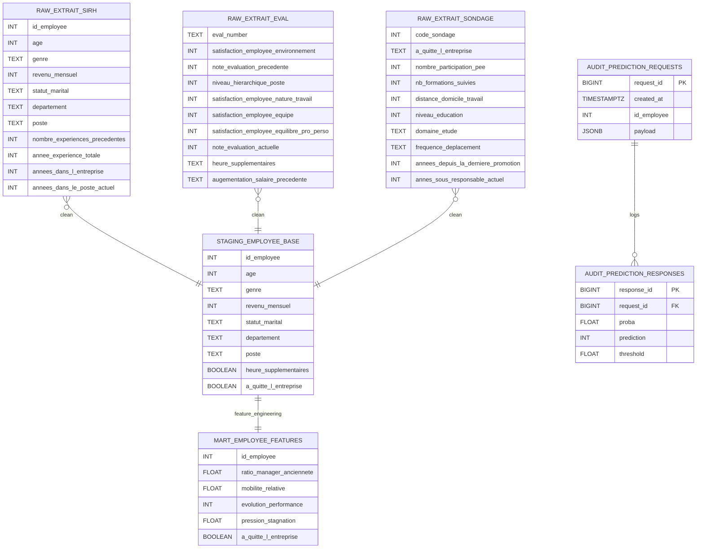

# Technova ML API – Documentation SQL & Base de Données

## Objectif
Ce document décrit en détail l’architecture de la base de données PostgreSQL utilisée par **Technova ML API**.
La base est organisée selon une approche analytique en couches : **RAW → STAGING → MART → AUDIT**.

---

### Initialisation de la base de données

Les scripts SQL doivent être exécutés dans l’ordre suivant afin de garantir
la cohérence des données et des dépendances entre les schémas :

1. `schema.sql` : création des schémas PostgreSQL (raw, staging, mart, audit)
2. `raw.sql` : création des tables de données brutes
3. `load_raw.sql` : chargement des données sources
4. `staging.sql` : nettoyage, normalisation et jointure des données
5. `mart.sql` : création du dataset final pour le modèle ML
6. `audit.sql` : création des tables de traçabilité des prédictions

Cet ordre permet d’assurer l’intégrité des données et la reproductibilité
du pipeline de traitement.

Les scripts sont conçus pour être idempotents
(`DROP TABLE IF EXISTS`, `TRUNCATE`) afin de permettre
une réexécution sans effet de bord.

## Vue d’ensemble du pipeline de données

```text
RAW
 ├─ extrait_sirh
 ├─ extrait_eval
 └─ extrait_sondage
        │
        ▼
STAGING
 └─ employee_base
        │
        ▼
MART
 └─ employee_features
        │
        ├─ utilisé par le modèle de Machine Learning
        ▼
AUDIT
 ├─ prediction_requests
 └─ prediction_responses
```

---

## Diagramme UML – Modèle de données (ERD)



---

## Description des couches

### RAW
- Données brutes issues de différentes sources RH.
- Aucune transformation.
- Chargement via scripts SQL (`COPY`).

### STAGING
- Nettoyage des valeurs.
- Normalisation des types.
- Jointure des sources autour de `id_employee`.

### MART
- Dataset final utilisé par le modèle de Machine Learning.
- Features calculées (ratios, évolutions, indicateurs).
- Contient la cible `a_quitte_l_entreprise`.

### AUDIT
- Journalisation des appels API.
- Séparation claire entre requêtes et réponses.
- Garantit la traçabilité et l’auditabilité des prédictions.

---

